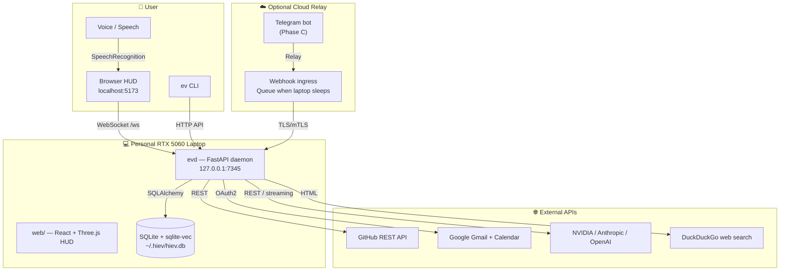
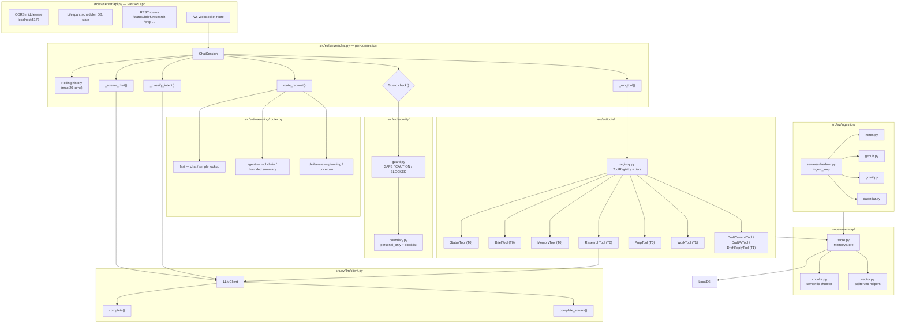
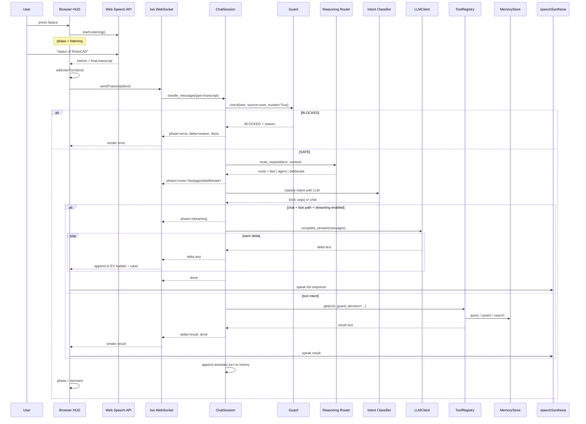
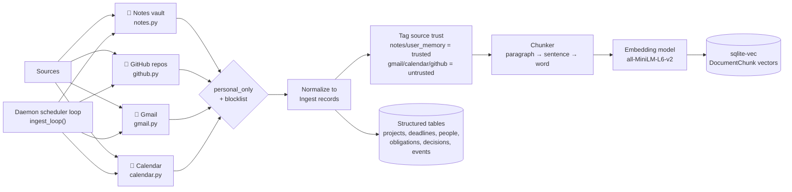
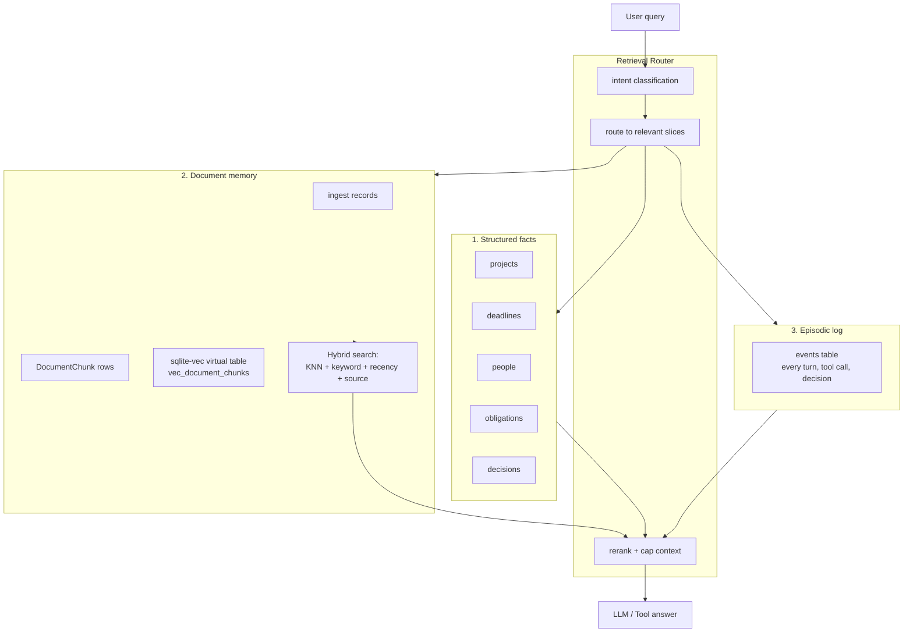
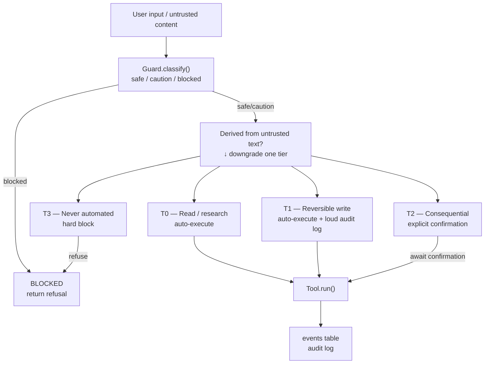
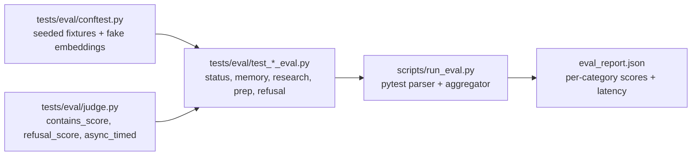
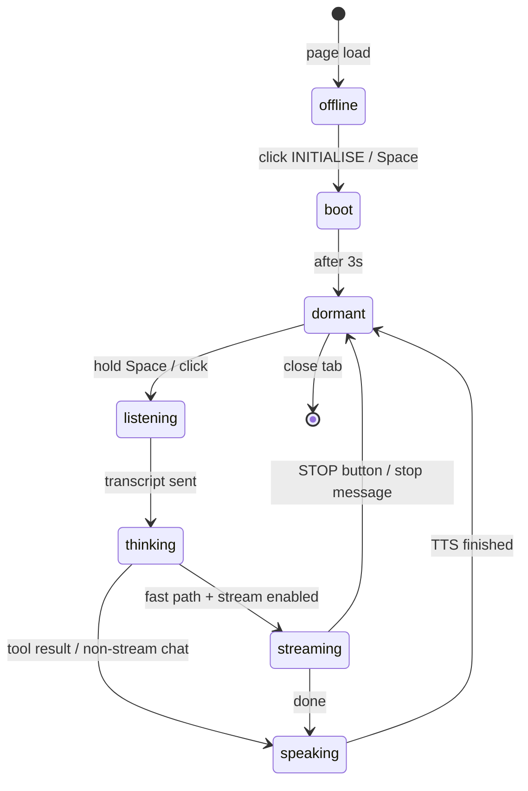
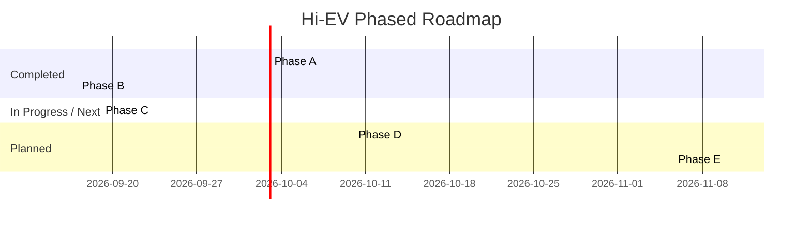
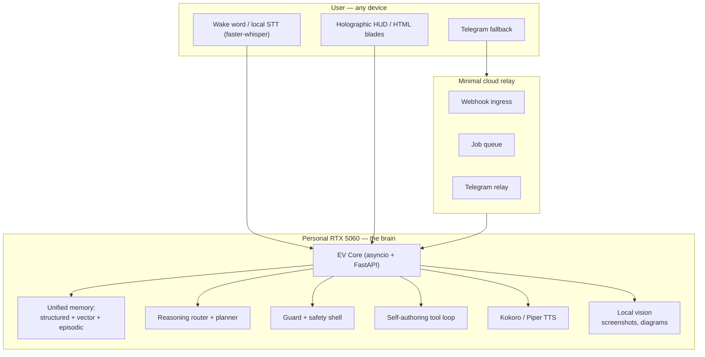

# Hi-EV — End-to-End Architecture & Vision Map

This document is a living map of the Hi-EV system as it exists today and the direction it is heading. Each diagram is rendered from Mermaid source so it can be edited and regenerated.

---

## 1. High-level system context

---

## 2. Daemon component architecture

---

## 3. Request lifecycle: voice to answer

---

## 4. Ingestion pipeline

---

## 5. Memory model

---

## 6. Safety, guard, and tier enforcement

---

## 7. Eval harness

---

## 8. Frontend streaming UI state machine

---

## 9. Roadmap to the full vision

---

## 10. End-state vision architecture

---

## Key file map

| Area | Primary files |
|------|---------------|
| Daemon / API | `src/ev/server/api.py`, `src/ev/server/chat.py`, `src/ev/server/scheduler.py` |
| Reasoning | `src/ev/reasoning/router.py` |
| Safety | `src/ev/security/guard.py`, `src/ev/security/boundary.py` |
| Tools | `src/ev/tools/registry.py`, `src/ev/tools/*_tool.py` |
| LLM | `src/ev/llm/client.py` |
| Memory | `src/ev/memory/store.py`, `src/ev/memory/chunks.py`, `src/ev/db/vector.py` |
| Ingestion | `src/ev/ingestion/notes.py`, `github.py`, `gmail.py`, `calendar.py` |
| Database | `src/ev/db/models.py`, `src/ev/db/base.py` |
| Frontend | `web/src/App.tsx`, `store.ts`, `lib/bridge.ts`, `lib/voice.ts`, `ui/Chat.tsx`, `scene/Scene.tsx` |
| Eval | `tests/eval/`, `scripts/run_eval.py` |
| Config | `src/ev/config.py`, `.env` |
