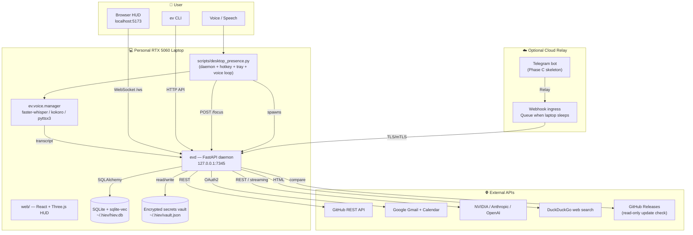
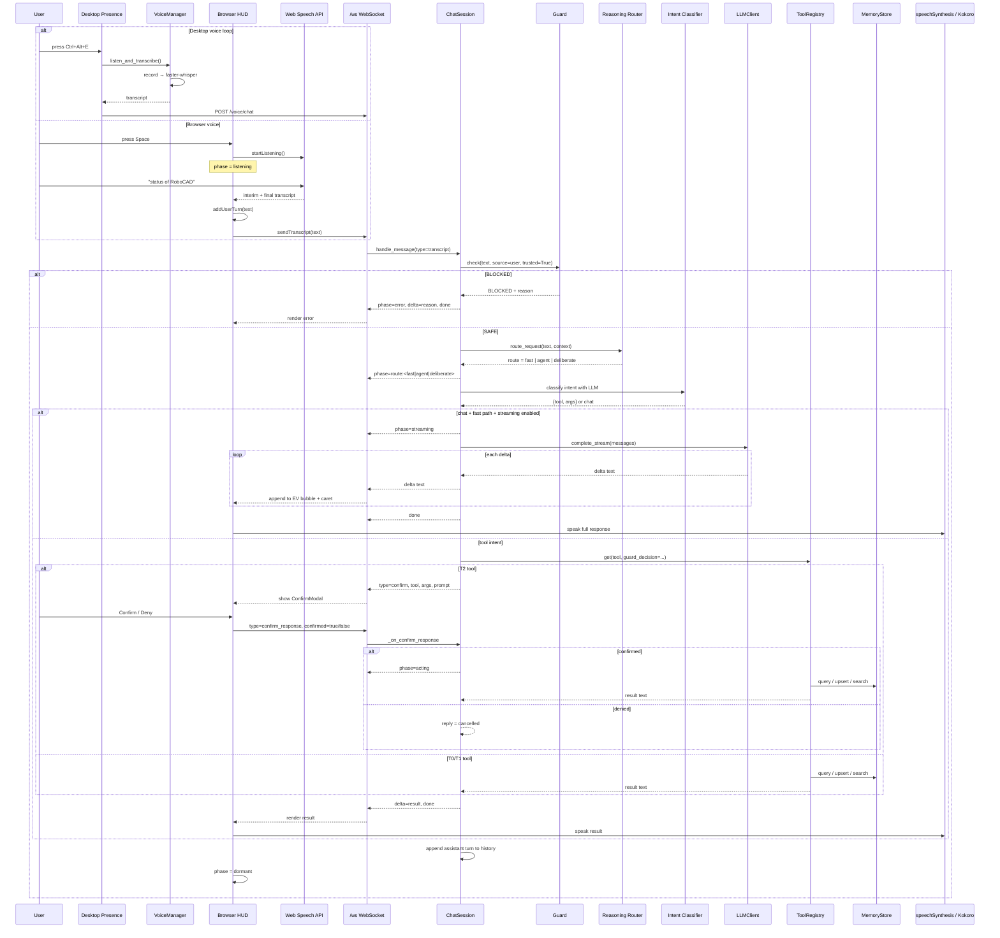
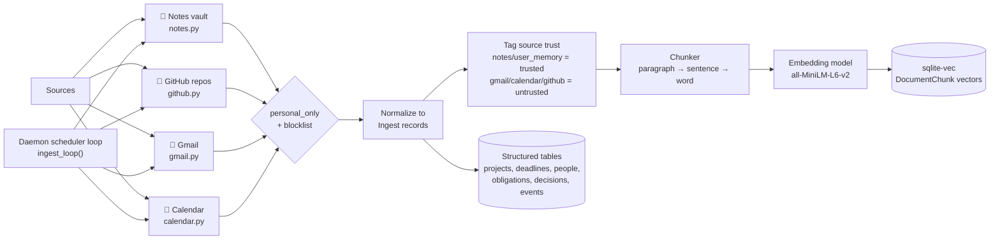
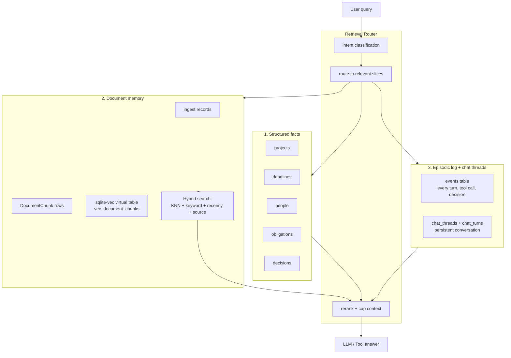
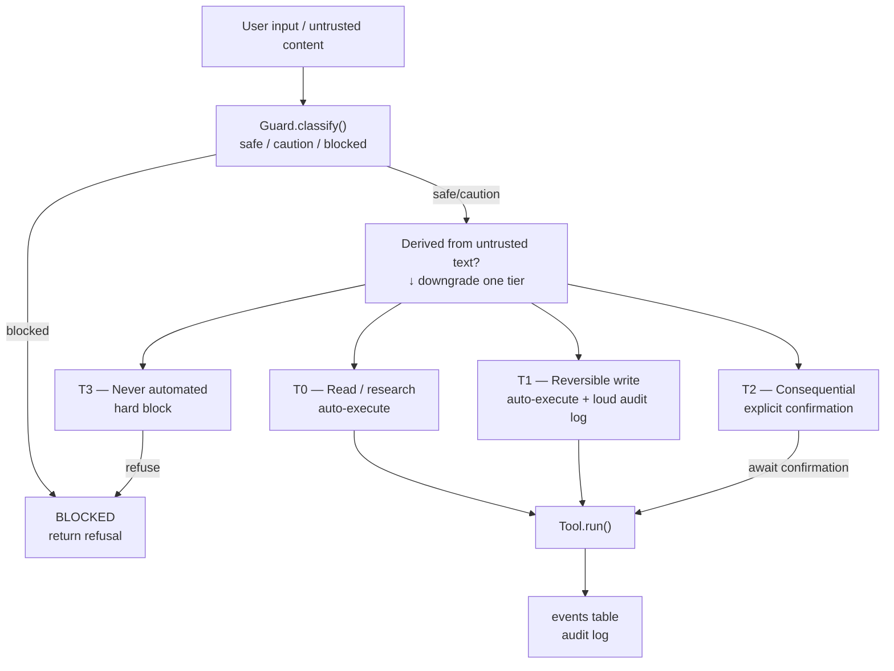
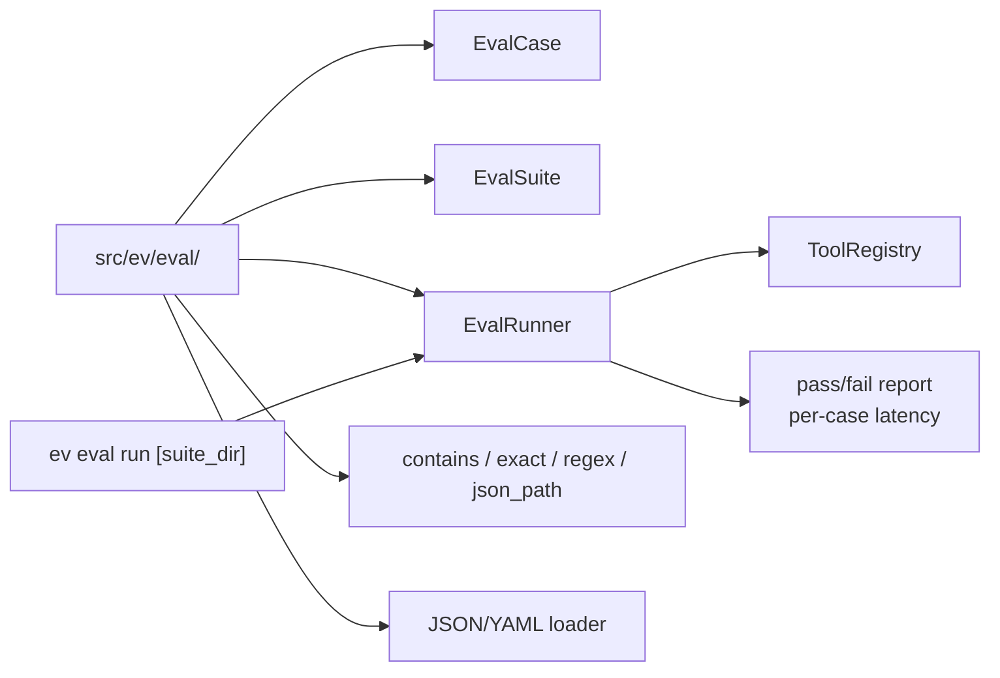
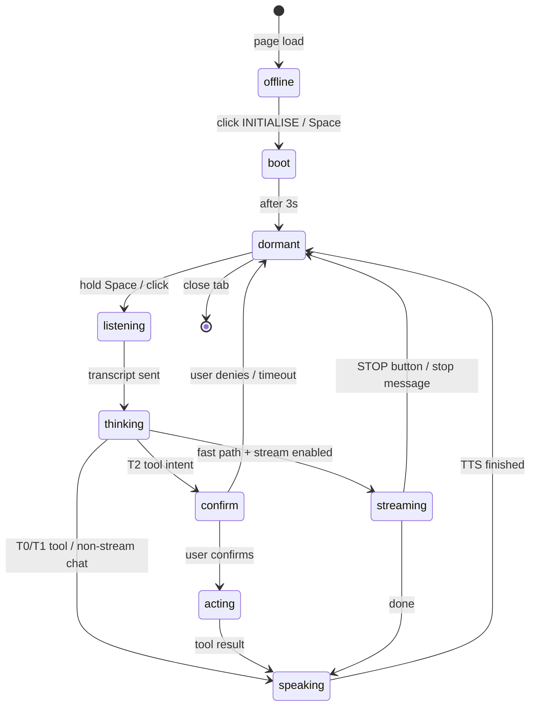
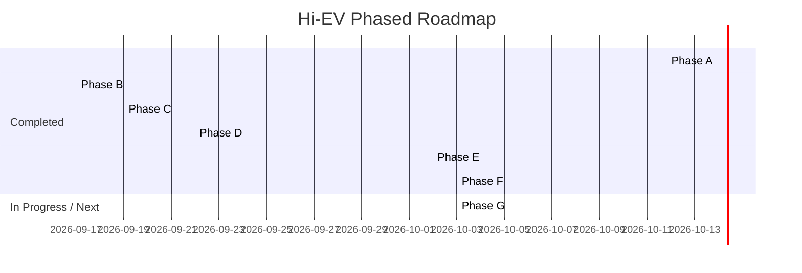
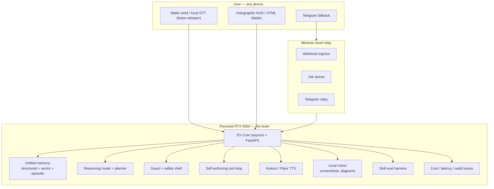

# Hi-EV — End-to-End Architecture & Vision Map

This document is a living map of the Hi-EV system as it exists today and the direction it is heading. Each diagram is rendered from Mermaid source so it can be edited and regenerated.

---

## 1. High-level system context

```mermaid
flowchart TB
    subgraph User["👤 User"]
        Voice["Voice / Speech"]
        Browser["Browser HUD\nlocalhost:5173"]
        CLI["ev CLI"]
    end

    subgraph Laptop["💻 Personal RTX 5060 Laptop"]
        direction TB
        Daemon["evd — FastAPI daemon\n127.0.0.1:7345"]
        WebFrontend["web/ — React + Three.js HUD"]
        DesktopPresence["scripts/desktop_presence.py\n(daemon + hotkey + tray + voice loop)"]
        VoiceManager["ev.voice.manager\nfaster-whisper / kokoro / pyttsx3"]
        LocalDB[("SQLite + sqlite-vec\n~/.hiev/hiev.db")]
        EncryptedVault[("Encrypted secrets vault\n~/.hiev/vault.json")]
    end

    subgraph Cloud["☁️ Optional Cloud Relay"]
        Relay["Webhook ingress\nQueue when laptop sleeps"]
        Telegram["Telegram bot\n(Phase C skeleton)"]
    end

    subgraph External["🌐 External APIs"]
        GitHubAPI["GitHub REST API"]
        GoogleAPI["Google Gmail + Calendar"]
        LLMAPI["NVIDIA / Anthropic / OpenAI"]
        WebSearch["DuckDuckGo web search"]
        GitHubReleases["GitHub Releases\n(read-only update check)"]
    end

    Voice --> DesktopPresence
    DesktopPresence --> VoiceManager
    VoiceManager --"transcript"--> Daemon
    Browser --"WebSocket /ws"--> Daemon
    CLI --"HTTP API"--> Daemon
    DesktopPresence --"POST /focus"--> Daemon
    DesktopPresence --"spawns"--> Daemon
    Daemon --"REST / streaming"--> LLMAPI
    Daemon --"REST"--> GitHubAPI
    Daemon --"OAuth2"--> GoogleAPI
    Daemon --"HTML"--> WebSearch
    Daemon --"SQLAlchemy"--> LocalDB
    Daemon --"read/write"--> EncryptedVault
    Daemon --"compare"--> GitHubReleases
    Relay --"TLS/mTLS"--> Daemon
    Telegram --"Relay"--> Relay
```

---

## 2. Daemon component architecture

```mermaid
flowchart TB
    subgraph FastAPI["src/ev/server/api.py — FastAPI app"]
        CORS["CORS middleware\nlocalhost:5173"]
        Lifespan["Lifespan: scheduler, DB, state"]
        REST["REST routes\n/status /brief /research /prep /voice/chat /skills ..."]
        WSRoute["/ws WebSocket route"]
    end

    subgraph Chat["src/ev/server/chat.py — per-connection"]
        ChatSession["ChatSession"]
        History["Rolling history\n(max 20 turns)"]
        GuardCheck{"Guard.check()"}
        Router["route_request()"]
        Intent["_classify_intent()"]
        Stream["_stream_chat()"]
        ToolRun["_run_tool()"]
        Confirm["_pending_confirmation\nconfirm/confirm_response"]
    end

    subgraph Reasoning["src/ev/reasoning/router.py"]
        FastPath["fast — chat / simple lookup"]
        AgentPath["agent — tool chain / bounded summary"]
        DeliberatePath["deliberate — planning / uncertain"]
    end

    subgraph Safety["src/ev/security/"]
        Guard["guard.py\nSAFE / CAUTION / BLOCKED"]
        Boundary["boundary.py\npersonal_only + blocklist"]
    end

    subgraph Core["src/ev/core/"]
        RegistryBase["registry.py\nRegistryBase[T] + @register"]
        ComponentABCs["component.py\nBaseTool / BaseAgent / BaseSkill / BaseEngine / BaseMemory"]
        Discovery["discovery.py\npkgutil auto-discovery"]
    end

    subgraph Tools["src/ev/tools/"]
        ToolRegistry["registry.py\nToolRegistry (thin wrapper)"]
        StatusTool["StatusTool (T0)"]
        BriefTool["BriefTool (T0)"]
        MemoryTool["MemoryTool (T0)"]
        ResearchTool["ResearchTool (T0)"]
        PrepTool["PrepTool (T0)"]
        WorkTool["WorkTool (T2)"]
        DraftTools["DraftCommitTool / DraftPrTool / DraftReplyTool (T2)"]
        SandboxTool["SandboxTool (T2)"]
    end

    subgraph Skills["src/ev/skills/"]
        SkillLoader["loader.py / manifest.py"]
        SkillTool["SkillTool / SkillToolAdapter"]
    end

    subgraph Voice["src/ev/voice/"]
        BaseSTT["BaseSTTBackend"]
        BaseTTS["BaseTTSBackend"]
        Whisper["faster_whisper backend"]
        Kokoro["kokoro backend"]
        Pyttsx3["pyttsx3 backend"]
        MockVoice["mock backend"]
        VoiceManager["manager.py\nVoiceManager"]
    end

    subgraph Sandbox["src/ev/sandbox/"]
        SandboxPolicy["policy.py"]
        CodeRunner["runner.py"]
        IsolatedRunner["isolated.py"]
    end

    subgraph Eval["src/ev/eval/"]
        EvalCase["EvalCase"]
        EvalSuite["EvalSuite"]
        EvalRunner["EvalRunner"]
    end

    subgraph Secrets["src/ev/secrets/"]
        EncryptedStore["EncryptedSecretStore"]
    end

    subgraph Updater["src/ev/updater/"]
        UpdateChecker["UpdateChecker"]
    end

    subgraph Memory["src/ev/memory/"]
        Store["store.py\nMemoryStore"]
        Chunks["chunks.py\nsemantic chunker"]
        Vector["vector.py\nsqlite-vec helpers"]
    end

    subgraph LLM["src/ev/llm/client.py"]
        LLMClient["LLMClient"]
        Complete["complete()"]
        CompleteStream["complete_stream()"]
    end

    subgraph Ingestion["src/ev/ingestion/"]
        Scheduler["server/scheduler.py\ningest_loop"]
        Notes["notes.py"]
        GitHub["github.py"]
        Gmail["gmail.py"]
        Calendar["calendar.py"]
    end

    WSRoute --> ChatSession
    ChatSession --> GuardCheck
    ChatSession --> Router
    ChatSession --> Intent
    ChatSession --> Stream
    ChatSession --> ToolRun
    ChatSession --> Confirm
    ChatSession --> History

    GuardCheck --> Guard
    Guard --> Boundary

    Router --> FastPath
    Router --> AgentPath
    Router --> DeliberatePath

    ToolRun --> ToolRegistry
    ToolRegistry --> RegistryBase
    RegistryBase --> StatusTool
    RegistryBase --> BriefTool
    RegistryBase --> MemoryTool
    RegistryBase --> ResearchTool
    RegistryBase --> PrepTool
    RegistryBase --> WorkTool
    RegistryBase --> DraftTools
    RegistryBase --> SandboxTool

    Skills --> SkillLoader
    SkillLoader --> SkillTool
    SkillTool --> RegistryBase

    Tools --> Store
    Store --> Chunks
    Store --> Vector
    Store --> LocalDB

    Stream --> LLMClient
    Intent --> LLMClient
    ResearchTool --> LLMClient
    LLMClient --> Complete
    LLMClient --> CompleteStream

    VoiceManager --> BaseSTT
    VoiceManager --> BaseTTS
    BaseSTT --> Whisper
    BaseSTT --> MockVoice
    BaseTTS --> Kokoro
    BaseTTS --> Pyttsx3
    BaseTTS --> MockVoice

    Scheduler --> Notes
    Scheduler --> GitHub
    Scheduler --> Gmail
    Scheduler --> Calendar
    Ingestion --> Store
```

---

## 3. Request lifecycle: voice to answer

```mermaid
sequenceDiagram
    participant U as User
    participant DP as Desktop Presence
    participant VM as VoiceManager
    participant FE as Browser HUD
    participant SR as Web Speech API
    participant WS as /ws WebSocket
    participant CS as ChatSession
    participant G as Guard
    participant R as Reasoning Router
    participant IC as Intent Classifier
    participant LLM as LLMClient
    participant TR as ToolRegistry
    participant Mem as MemoryStore
    participant TTS as speechSynthesis / Kokoro

    alt Desktop voice loop
        U->>DP: press Ctrl+Alt+E
        DP->>VM: listen_and_transcribe()
        VM->>VM: record → faster-whisper
        VM-->>DP: transcript
        DP->>WS: POST /voice/chat
    else Browser voice
        U->>FE: press Space
        FE->>SR: startListening()
        Note over FE: phase = listening
        U->>SR: "status of RoboCAD"
        SR-->>FE: interim + final transcript
        FE->>FE: addUserTurn(text)
        FE->>WS: sendTranscript(text)
    end

    WS->>CS: handle_message(type=transcript)

    CS->>G: check(text, source=user, trusted=True)
    alt BLOCKED
        G-->>CS: BLOCKED + reason
        CS-->>WS: phase=error, delta=reason, done
        WS-->>FE: render error
    else SAFE
        CS->>R: route_request(text, context)
        R-->>CS: route = fast | agent | deliberate
        CS-->>WS: phase=route:<fast|agent|deliberate>

        CS->>IC: classify intent with LLM
        IC-->>CS: {tool, args} or chat

        alt chat + fast path + streaming enabled
            CS-->>WS: phase=streaming
            CS->>LLM: complete_stream(messages)
            loop each delta
                LLM-->>CS: delta text
                CS-->>WS: delta text
                WS-->>FE: append to EV bubble + caret
            end
            CS-->>WS: done
            FE->>TTS: speak full response
        else tool intent
            CS->>TR: get(tool, guard_decision=...)
            alt T2 tool
                CS-->>WS: type=confirm, tool, args, prompt
                WS-->>FE: show ConfirmModal
                U->>FE: Confirm / Deny
                FE->>WS: type=confirm_response, confirmed=true/false
                WS->>CS: _on_confirm_response
                alt confirmed
                    CS-->>WS: phase=acting
                    TR->>Mem: query / upsert / search
                    TR-->>CS: result text
                else denied
                    CS-->>CS: reply = cancelled
                end
            else T0/T1 tool
                TR->>Mem: query / upsert / search
                TR-->>CS: result text
            end
            CS-->>WS: delta=result, done
            WS-->>FE: render result
            FE->>TTS: speak result
        end

        CS->>CS: append assistant turn to history
        FE->>FE: phase = dormant
    end
```

---

## 4. Ingestion pipeline

```mermaid
flowchart LR
    Sources["Sources"]
    Notes["📝 Notes vault\nnotes.py"]
    GitHub["🔧 GitHub repos\ngithub.py"]
    Gmail["📧 Gmail\ngmail.py"]
    Calendar["📅 Calendar\ncalendar.py"]

    Boundary{"personal_only\n+ blocklist"}
    Normalize["Normalize to\nIngest records"]
    TrustTag["Tag source trust\nnotes/user_memory = trusted\ngmail/calendar/github = untrusted"]
    Chunker["Chunker\nparagraph → sentence → word"]
    Embed["Embedding model\nall-MiniLM-L6-v2"]
    Structured[("Structured tables\nprojects, deadlines, people,\nobligations, decisions, events")]
    Vectors[("sqlite-vec\nDocumentChunk vectors")]
    Scheduler["Daemon scheduler loop\ningest_loop()"]

    Sources --> Notes & GitHub & Gmail & Calendar
    Notes & GitHub & Gmail & Calendar --> Boundary
    Boundary --> Normalize
    Normalize --> TrustTag
    TrustTag --> Chunker
    Chunker --> Embed
    Embed --> Vectors
    Normalize --> Structured
    Scheduler --> Notes & GitHub & Gmail & Calendar
```

---

## 5. Memory model

```mermaid
flowchart TB
    subgraph Structured["1. Structured facts"]
        Projects["projects"]
        Deadlines["deadlines"]
        People["people"]
        Obligations["obligations"]
        Decisions["decisions"]
    end

    subgraph Document["2. Document memory"]
        Ingest["ingest records"]
        Chunks["DocumentChunk rows"]
        Vec["sqlite-vec virtual table\nvec_document_chunks"]
        Hybrid["Hybrid search:\nKNN + keyword + recency + source"]
    end

    subgraph Episodic["3. Episodic log + chat threads"]
        Events["events table\nevery turn, tool call, decision"]
        Threads["chat_threads + chat_turns\npersistent conversation"]
    end

    subgraph Retrieval["Retrieval Router"]
        Intent["intent classification"]
        Route["route to relevant slices"]
        Rerank["rerank + cap context"]
    end

    UserQuery["User query"] --> Intent
    Intent --> Route
    Route --> Structured
    Route --> Document
    Route --> Episodic
    Structured --> Rerank
    Document --> Hybrid --> Rerank
    Episodic --> Rerank
    Rerank --> LLM["LLM / Tool answer"]
```

---

## 6. Safety, guard, and tier enforcement

```mermaid
flowchart TD
    Input["User input / untrusted content"]
    Guard["Guard.classify()\nsafe / caution / blocked"]
    Block["BLOCKED\nreturn refusal"]
    Tier0["T0 — Read / research\nauto-execute"]
    Tier1["T1 — Reversible write\nauto-execute + loud audit log"]
    Tier2["T2 — Consequential\nexplicit confirmation"]
    Tier3["T3 — Never automated\nhard block"]
    TrustDowngrade["Derived from untrusted text?\n↓ downgrade one tier"]
    ToolRun["Tool.run()"]
    Audit["events table\naudit log"]

    Input --> Guard
    Guard -->|blocked| Block
    Guard -->|safe/caution| TrustDowngrade
    TrustDowngrade --> Tier0
    TrustDowngrade --> Tier1
    TrustDowngrade --> Tier2
    TrustDowngrade --> Tier3
    Tier0 --> ToolRun
    Tier1 --> ToolRun
    Tier2 -->|await confirmation| ToolRun
    Tier3 -->|refuse| Block
    ToolRun --> Audit
```

---

## 7. Eval harness

```mermaid
flowchart LR
    EvalPackage["src/ev/eval/"]
    EvalCase["EvalCase"]
    EvalSuite["EvalSuite"]
    EvalRunner["EvalRunner"]
    Checks["contains / exact / regex / json_path"]
    Loader["JSON/YAML loader"]
    CLI["ev eval run [suite_dir]"]
    Report["pass/fail report\nper-case latency"]

    EvalPackage --> EvalCase
    EvalPackage --> EvalSuite
    EvalPackage --> EvalRunner
    EvalPackage --> Checks
    EvalPackage --> Loader
    EvalRunner --> ToolRegistry
    EvalRunner --> Report
    CLI --> EvalRunner
```

---

## 8. Frontend streaming UI state machine

```mermaid
stateDiagram-v2
    [*] --> offline: page load
    offline --> boot: click INITIALISE / Space
    boot --> dormant: after 3s
    dormant --> listening: hold Space / click
    listening --> thinking: transcript sent
    thinking --> streaming: fast path + stream enabled
    thinking --> confirm: T2 tool intent
    thinking --> speaking: T0/T1 tool / non-stream chat
    confirm --> acting: user confirms
    confirm --> dormant: user denies / timeout
    acting --> speaking: tool result
    streaming --> speaking: done
    speaking --> dormant: TTS finished
    streaming --> dormant: STOP button / stop message
    dormant --> [*]: close tab
```

---

## 9. Roadmap to the full vision

```mermaid
gantt
    title Hi-EV Phased Roadmap
    dateFormat 2026-09-01
    section Completed
    Phase A :done, a, 2026-09-01, 2026-09-17
    Phase B :done, b, 2026-09-17, 2026-09-19
    Phase C :done, c, 2026-09-19, 2026-09-22
    Phase D :done, d, 2026-09-22, 2026-10-02
    Phase E :done, e, 2026-10-02, 2026-10-03
    Phase F :done, f, 2026-10-03, 2026-10-03
    section In Progress / Next
    Phase G :active, g, 2026-10-03, 2026-11-24
```

---

## 10. End-state vision architecture

```mermaid
flowchart TB
    subgraph EndUser["User — any device"]
        Voice2["Wake word / local STT (faster-whisper)"]
        HUD2["Holographic HUD / HTML blades"]
        Phone2["Telegram fallback"]
    end

    subgraph EndLaptop["Personal RTX 5060 — the brain"]
        Core["EV Core (asyncio + FastAPI)"]
        Memory2["Unified memory:\nstructured + vector + episodic"]
        Reasoning2["Reasoning router + planner"]
        Guard2["Guard + safety shell"]
        ToolSelf["Self-authoring tool loop"]
        LocalTTS["Kokoro / Piper TTS"]
        Vision["Local vision\nscreenshots, diagrams"]
        SkillEval["Skill eval harness"]
        Observability["Cost / latency / audit traces"]
    end

    subgraph MinimalCloud["Minimal cloud relay"]
        Webhooks["Webhook ingress"]
        Queue["Job queue"]
        TelegramRelay["Telegram relay"]
    end

    Voice2 --> Core
    HUD2 --> Core
    Phone2 --> MinimalCloud --> Core
    Core --> Memory2
    Core --> Reasoning2
    Core --> Guard2
    Core --> ToolSelf
    Core --> LocalTTS
    Core --> Vision
    Core --> SkillEval
    Core --> Observability
```

---

## Key file map

| Area | Primary files |
|------|---------------|
| Daemon / API | `src/ev/server/api.py`, `src/ev/server/chat.py`, `src/ev/server/scheduler.py` |
| Reasoning | `src/ev/reasoning/router.py` |
| Safety | `src/ev/security/guard.py`, `src/ev/security/boundary.py` |
| Plugin core | `src/ev/core/registry.py`, `src/ev/core/component.py`, `src/ev/core/discovery.py` |
| Tools | `src/ev/tools/registry.py`, `src/ev/tools/*_tool.py` |
| Skills | `src/ev/skills/loader.py`, `src/ev/skills/manifest.py`, `src/ev/skills/skill_tool.py`, `skills/*/SKILL.md` |
| Voice | `src/ev/voice/component.py`, `src/ev/voice/io.py`, `src/ev/voice/manager.py`, `src/ev/voice/backends/*.py` |
| Sandbox | `src/ev/sandbox/policy.py`, `src/ev/sandbox/runner.py`, `src/ev/sandbox/isolated.py`, `src/ev/tools/sandbox_tool.py` |
| Eval | `src/ev/eval/*.py` |
| Secrets | `src/ev/secrets/store.py` |
| Updater | `src/ev/updater/checker.py` |
| LLM | `src/ev/llm/client.py` |
| Memory | `src/ev/memory/store.py`, `src/ev/memory/chunks.py`, `src/ev/db/vector.py` |
| Ingestion | `src/ev/ingestion/notes.py`, `github.py`, `gmail.py`, `calendar.py` |
| Database | `src/ev/db/models.py`, `src/ev/db/base.py` |
| Frontend | `web/src/App.tsx`, `store.ts`, `lib/bridge.ts`, `lib/voice.ts`, `ui/Chat.tsx`, `ui/ConfirmModal.tsx`, `ui/Threads.tsx`, `ui/Alerts.tsx`, `ui/SetupWizard.tsx`, `scene/Scene.tsx` |
| Desktop presence | `scripts/desktop_presence.py` |
| Config | `src/ev/config.py`, `.env` |
